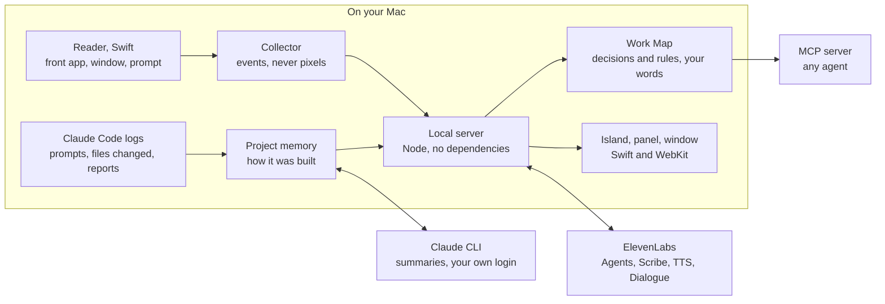

# Mason

Learning by doing, without the forgetting.

I vibe-coded it. A month later I can't explain it. The code stays, but the knowledge of how and why stays in the prompts, somewhere in one of 120 agent sessions.

Mason is a local macOS assistant that was there. It remembers how a project was built, asks me about it until it sticks, and hands my taste to every agent I use.

Built solo by Gustaf Garnow for Challenge 01, The AI Apprentice, at the Hack-Nation 7th Global AI Hackathon.

Live page with the pitch film: https://mason-demo-eight.vercel.app


## What it does

| | |
|---|---|
| **Watches the work, not the screen** | It reads the front app, the window title and the prompt field through macOS Accessibility. No screenshots, no keystrokes. In the background it never asks anything. |
| **Remembers how it was built** | Every Claude Code session of a project folder is folded into one memory: what it is, how it is put together, where it was left, what is still open. |
| **Picks up your rules without asking** | A correction you gave an agent twice is a rule you never wrote down. It lands in the Work Map with your own words as evidence. |
| **Talks, when you take the call** | Three ElevenLabs agents: a debrief about today, a recall call that asks what you still know about your own project, and a tutor that stops a new person before they break a rule. |
| **Hands it to every agent** | The same memory is an MCP server: `how_was_it_built`, `guardrails_for_agents`, `check_decision`. |

ElevenLabs in the build: Agents (three), Scribe v2 Realtime, Text to Speech (Flash v2.5) and Text to Dialogue (v3) for a weekly two-voice recap.

## How it is put together



Nothing leaves the Mac until a voice is used: then the words to be spoken, the audio of an answer, and for a call a summary of the day. Summaries go through your own Claude login, the same place the prompts already went.

## Where things are

| Folder | What |
|---|---|
| [`apprentice/`](apprentice/) | The app (the folder keeps its first name): native macOS island, local server, ElevenLabs voice, MCP server. Start with its [README](apprentice/README.md). |
| [`film/`](film/) | How the three submission films were made: the app window is driven and recorded headlessly, then cut and captioned by script. |
| [`site/`](site/) | The public page. |

## Run it

```bash
cd apprentice
cp .env.local.example .env.local   # optional: an ElevenLabs key turns on the voice
npm run build:reader               # builds Mason.app with swiftc
open Mason.app
```

macOS 13 or later, Node 18 or later, Xcode command line tools. No packages to install: the server has no dependencies.

Press the island in the menu bar. The first time it asks for Accessibility, which is how it sees which app and window you are in. Name, sound and the rest are under the gear in the app window.

```bash
npm test                           # 20 tests, no network
```

## What is not in this repository

The memory. `apprentice/data/` and `apprentice/wiki/` are built on your own Mac from your own agent logs, and they stay there.
