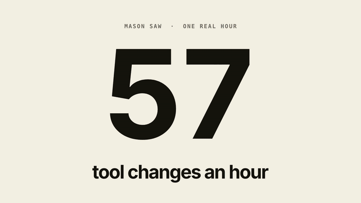

# You jump between AI apps all day. See where it goes.

**Mason** is a free Mac app that sits in the background and shows how you really work.



[mason.tools](https://www.mason.tools) · [Docs](https://www.mason.tools/docs/) · Free · Open source · Local-first

## What it does

- **See every jump.** How often you move between apps, and between which.
- **Look back on a day or a month.** What you worked on, and where the time went.
- **Share your flow.** Your day as one picture, with only the names of your tools on it.

It works with every app and website, and reads the logs that Claude Code, Codex, Grok and Cursor already keep on your Mac. There is nothing to fill in.

## Get it

```bash
git clone https://github.com/Baltsar/mason.git ~/mason
cd ~/mason/apprentice
npm run build:reader
open Mason.app
```

macOS 13 or later, Node 18 or later and the Xcode command line tools. Nothing else to install. A download you just open is on its way.

On the first start it asks for one thing, Accessibility, which is how it sees the app and window in front. Then it lives in the island in the menu bar. [Get started](docs/get-started.md) has the first minute, step by step.

## What it reads, sends and keeps

| | |
|---|---|
| **Reads** | The app and window in front, the site of a browser tab and the prompt you are typing, through macOS Accessibility. And your agents' logs. No screenshots, no log of your keys. |
| **Sends** | Four things can leave the Mac: summaries to a model (by default your own Claude login), speech if you give it a voice, a request for a site's icon, and a look for a new version. Each has a switch. With all four off, nothing leaves. |
| **Keeps** | Files in two folders on your Mac. Delete them and the memory is gone. No account, no server. |

The whole of it is in [what it reads, sends and keeps](docs/privacy.md), and every claim is tied to code and a test in [CLAIMS](docs/CLAIMS.md).

## More

| | |
|---|---|
| [What you see](docs/what-you-see.md) | Every view: the island, Today, Flow, Days, Workflow. |
| [Models and voice](docs/models-and-voice.md) | Which AI writes the summaries, and how to change it. |
| [Agents and MCP](docs/agents-and-mcp.md) | What an agent can ask Mason. |
| [Workflows](workflows/) | How other people work with agents, to try beside your own. |
| [Every setting](docs/configuration.md) · [When something is off](docs/troubleshooting.md) | Look it up. |
| [How it is built](docs/how-it-is-built.md) | A native island in Swift, a local server in Node with no dependencies. |
| [Hack-Nation 7](HACKATHON.md) | Where it began, and the long list of everything it does. |

<details>
<summary><b>Limits</b></summary>

- The memory is stored on the Mac, but the voice is not: speech, calls and dictation go through ElevenLabs, and summaries through your Claude login or the model you chose. Both have a switch in Settings. With ElevenLabs and summaries switched off, nothing leaves the Mac: Mason then speaks with the Mac's own voice, there are no calls, and the memory is your own words.
- macOS only. The memory is built from Claude Code logs; chats in ChatGPT or on claude.ai are not on disk and are not read.
- Flow knows a site by the address of the front tab, of which only the host is kept ("figma.com"). Chat and mail are left out unless you switch on naming them; then their name and the time are kept, never a title. A site shows a lettered tile unless you switch on Logos from the web; then Mason asks each site once for its own icon, which is one more thing that leaves the Mac.
- The local server listens on this Mac only, and answers only Mason's own window, the island and the agents that were given its address. A page in a browser that is not Mason's own is refused, so a link someone sends cannot switch a setting or read the memory. Another program on this Mac that only reaches the port is refused as well: everything but the pages themselves needs a key that is made anew at every start and handed to Mason's own windows, the island, and the agents you give it to. A program that runs as you and may read your files is not stopped by it; it could read the memory on disk without asking.
- A rule from someone else's workflow is checked before it is offered, but the check is a net, not a judge: read the prompt before you send it to an agent.
- Tokens are the agents' own count, and most of a month's are the same conversation read again from a cache. It is a count, not a cost. Of Cursor, Mason reads what you asked and when, not how long it worked and not its tokens. ChatGPT and Claude as chat apps keep nothing on disk that can be read; they are seen as tools in Flow and no more.
- "How it is put together" and "what was decided" come from your prompts, what the agents reported and the names of the files they changed. File contents are never read, and a line can be wrong where an agent was, or where a model read a wish as a decision.
- Live questions in a session and the written check in Teach are deterministic. The calls judge by meaning.
- More in the app's [README](apprentice/README.md#boundaries-of-this-slice).

</details>

## Work on it

```bash
cd apprentice
npm test                           # no network, no data of yours needed
npm run workflows -- check         # every file in the collection may be there
```

Both run on every pull request. See [CONTRIBUTING](CONTRIBUTING.md) and [SECURITY](SECURITY.md). The app is in [`apprentice/`](apprentice/) (the folder keeps its first name).

---

It is free, under the MIT license. The man who built it is for hire: [headless.design](https://headless.design).
