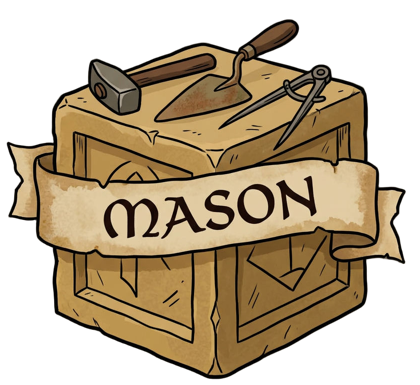
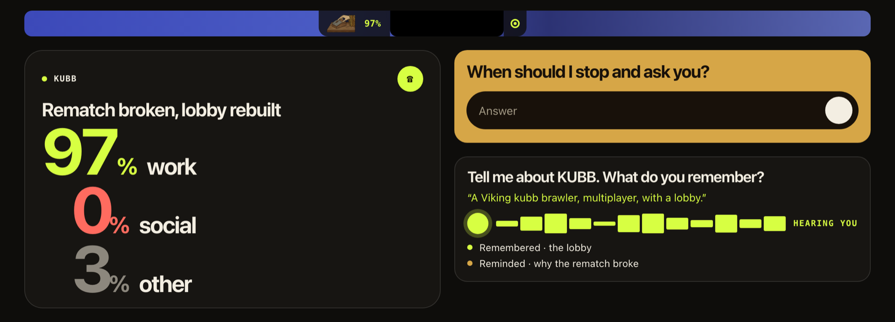
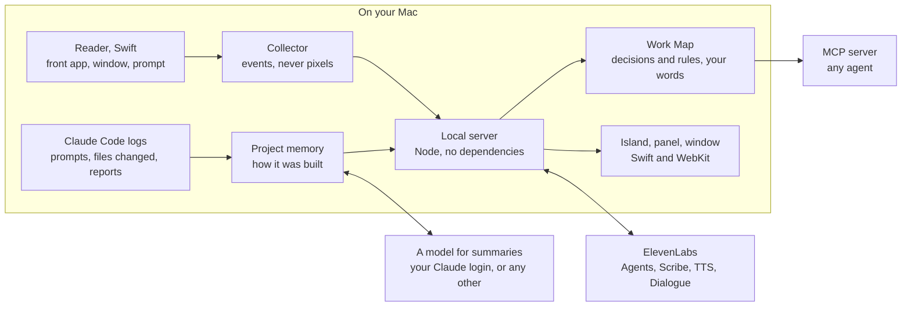

# Mason

Learning by doing, without the forgetting.

I vibe-coded it. A month later I can't explain it. The code stays, but the knowledge of how and why stays in the prompts, somewhere in one of 120 agent sessions.

Mason is a local macOS assistant that was there. It remembers how a project was built, asks me about it until it sticks, and hands my taste to every agent I use.

Built solo by Gustaf Garnow for Challenge 01, The AI Apprentice, at the Hack-Nation 7th Global AI Hackathon.

Live page with the pitch film: https://mason-demo-eight.vercel.app



## What it does

| | |
|---|---|
| **Watches the work, not the screen** | It reads the front app, the window title, the site of a browser tab and the prompt field through macOS Accessibility. No screenshots, no keystrokes, and of an address only the name of the site. In the background it never asks anything. |
| **Remembers how it was built** | Every Claude Code session of a project folder is folded into one memory: what it is, how it is put together, where it was left, what is still open. |
| **Picks up your rules without asking** | A correction you gave an agent twice is a rule you never wrote down. It lands in the Work Map with your own words as evidence. |
| **Talks, when you take the call** | Three ElevenLabs agents: a debrief about today, a recall call that asks what you still know about your own project, and a tutor that stops a new person before they break a rule. |
| **Keeps it as files you own** | The memory is also a folder of plain Markdown notes with links between them: projects, rules and the Work Map. Open `apprentice/wiki/` in Obsidian or any editor. |
| **Hands it to every agent** | The same memory is an MCP server: `how_was_it_built`, `guardrails_for_agents`, `check_decision`. |
| **Teaches you your own work** | Built asks one question at a time about a project you worked on: how it is put together, what you decided, what you built last, where you left it. A press shows what Mason remembers. Nothing is typed, and the same questions can be asked aloud. |
| **Looks back, unasked** | Mason is a mirror: it is never told what a day is for. After three days of work it says how the work was done, in at most three plain sentences: where you went right after sending a prompt, how long finished answers from your agents waited, how often you changed tool. Written once, left as it was, with the numbers one press away. A word on the island says when an answer is ready and you are somewhere else. |
| **Proposes, and says why** | What you told your agents again and again in several projects is proposed as one line in the file every agent reads, shown with the words it rests on. Nothing is written without a press, the wording can be changed first, and a line can be taken out again. A rule that would let agents publish or delete without asking is never proposed. |
| **Shows how you move** | Flow: the tools of the day with their own icons, and a line between two of them as thick as the jumps between them. A tool in a browser tab is known by the site it is on. Five tools, three habits, one band for the day. Under the picture every tool of the day is named, and pressing one shows it among the tools it trades places with. |
| **Finds what you said** | Find: type what it was about and get the project, by meaning and not by the words, in Swedish or English. With nothing typed it shows what you told your agents again and again across projects, in your own words. An embedding model on this Mac does the reading; off until switched on. |
| **Nudges, and checks whether it helped** | A word on the island when an answer has waited longer than you usually leave one, or when what you just asked for was done before in another project. Each is followed up, and a kind you keep ignoring goes quiet by itself. |
| **Makes it a picture to share** | Share draws the flow of the day or the week as one picture: what you built with, the habits between the tools, three figures. Only the names of tools are on it. It starts with the five tools the work was done in, and any tool goes in or out with a press, seven at most. Mason writes the file and posts nothing. |
| **Keeps the long view** | Days: a calendar of every day worked, back to the first day of each project, and each project's month as a strip. |

ElevenLabs in the build: Agents (three), Scribe v2 Realtime, Text to Speech (Flash v2.5) and Text to Dialogue (v3) for a weekly two-voice recap.

## Against the brief

This section describes what was submitted, the tag `hack-nation-7`. Two of its pages have since been taken out of the app window; see [After the hackathon](#after-the-hackathon).

The challenge asks for three modules and five answers. One twist: the expert is me today, and the new hire is me in a month, and every agent I work with.

| The brief requires | In Mason | Where |
|---|---|---|
| **Capture.** At least three questions during a real task, each at a natural pause and about what is on screen, one of them about a guardrail. | In a capture session Mason reads the prompt being typed and asks aloud once it has been still for six seconds: at most five questions, at least ninety seconds apart. A prompt that sets a limit gets the guardrail question. Asked with ElevenLabs speech, answered through Scribe v2 Realtime. | App window → Capture → Start |
| **Map.** A spoken debrief with follow-up questions that ends in a teach-back the expert confirms. Every step linked to a screen moment and the expert's own words. | An ElevenLabs agent takes the call, asks about what the session left open, saves each answer as a step while you talk, explains the whole thing back and waits for you to confirm it. Each step keeps its moment (time, app, window) and your quote. | Panel → the phone. App window → Map |
| **Teach.** A new hire works a case the expert never showed. The tutor catches a wrong decision before it is saved, explains it with the expert's reasoning, and shows what was mastered. | A tutor agent that holds only your rules: "Gustaf would stop here. Why do you think?", then your own words. In a session the same stop is spoken while the wrong prompt is still unsent. Stopped, then right the second time, counts as mastered. | App window → Teach → Tutor call |

The Apprentice Test:

1. **When to ask.** Never in the background. In a session: when the prompt text has been still for six seconds, or the hands have been still since a move between apps, then ninety seconds of quiet. The debrief is offered at a break, never started by itself.
2. **What to ask.** The agent is given the projects, the moves between them, the detours and your own prompts, and is told never to ask what the screen already answers.
3. **When it has understood.** It has explained the process back and you confirmed it. A correction is saved and said again first.
4. **Whether the new hire learned.** Teach records what stopped them and what they got right on the second try.
5. **Trust.** Go private stops everything at once. Password managers, mail, chat, banking and private windows are refused before anything is written, and counted but never named. Text is redacted before it is stored. Events, not screenshots. Settings says what Mason reads, what it sends and where it keeps it, with a switch on each.

Stretch goals met: **agent-ready guardrails** (the Work Map is an MCP server) and **any language** (I explain in Swedish; the tutor teaches in English and quotes me as I said it).

**The moonshot** is the always-on apprentice for people who build with agents. Mason already runs all day without sessions and builds its memory from work that happens anyway. Next it notices a decision it has not seen before and asks one question at the next real pause, and the memory follows the project instead of the Mac, so a teammate's agent starts where mine left off.

Every claim made in the films is tied to the code and a test in [docs/CLAIMS.md](docs/CLAIMS.md).

## How it is put together



Nothing leaves the Mac until a voice is used: then the words to be spoken, the audio of an answer, and for a call a summary of the day. Summaries go through your own Claude login, the same place the prompts already went, or through any other model you point Mason at, one on the Mac included.

A model is needed for three things only: the summary of a project, the script of the weekly recap, and saying which of your repeated rules mean the same. Watching, counting, the look back, Flow, Days, the questions in a session and the written check in Teach are plain code.

## Where things are

| Folder | What |
|---|---|
| [`apprentice/`](apprentice/) | The app (the folder keeps its first name): native macOS island, local server, ElevenLabs voice, MCP server. Start with its [README](apprentice/README.md). |
| [`film/`](film/) | How the three submission films were made: the app window is driven and recorded headlessly, then cut and captioned by script. |
| [`site/`](site/) | The public page. |

## Run it

```bash
cd apprentice
cp .env.local.example .env.local   # optional: an ElevenLabs key turns on the voice
npm run build:reader               # builds Mason.app with swiftc
open Mason.app
```

macOS 13 or later, Node 18 or later, Xcode command line tools. No packages to install: the server has no dependencies.

Press the island in the menu bar. The first time it asks for Accessibility, which is how it sees which app and window you are in. Name, sound and the rest are under the gear in the app window.

```bash
npm test                           # 74 tests, no network, no data of yours needed
```

## Limits

- The memory is stored on the Mac, but the voice is not: speech, calls and dictation go through ElevenLabs, and summaries through your Claude login or the model you chose. Both have a switch in Settings. With ElevenLabs and summaries switched off, nothing leaves the Mac: Mason then speaks with the Mac's own voice, there are no calls, and the memory is your own words.
- macOS only. The memory is built from Claude Code logs; chats in ChatGPT or on claude.ai are not on disk and are not read.
- Flow knows a site by the address of the front tab, of which only the host is kept ("figma.com"). Chat and mail are left out unless you switch on naming them; then their name and the time are kept, never a title. A site shows a lettered tile unless you switch on Logos from the web; then Mason asks each site once for its own icon, which is one more thing that leaves the Mac.
- "How it is put together" and "what was decided" come from your prompts, what the agents reported and the names of the files they changed. File contents are never read, and a line can be wrong where an agent was, or where a model read a wish as a decision.
- Live questions in a session and the written check in Teach are deterministic. The calls judge by meaning.
- More in the app's [README](apprentice/README.md#boundaries-of-this-slice).

## After the hackathon

What was submitted to Hack-Nation 7 on 4 October 2026 is the tag `hack-nation-7`. Taken out of the app window after the deadline: the Map page and Teach, the test of a new person, with its written check. They were built for the brief and not for daily use. The Work Map itself is still filled by a capture session and the debrief call, still stops a prompt that breaks a rule, and is still what an agent reads over MCP. Added after the deadline: Built, the look back, the proposals, Flow with the site of a tab and the picture to share, Days, Find by meaning with a model on the Mac, the switches for ElevenLabs, the agent logs and naming chat and mail, and the choice of model for summaries. Map, Teach (there called New person), Recap and Agents, built for the challenge, are under More.

## What is not in this repository

The memory. `apprentice/data/` and `apprentice/wiki/` are built on your own Mac from your own agent logs, and they stay there.
