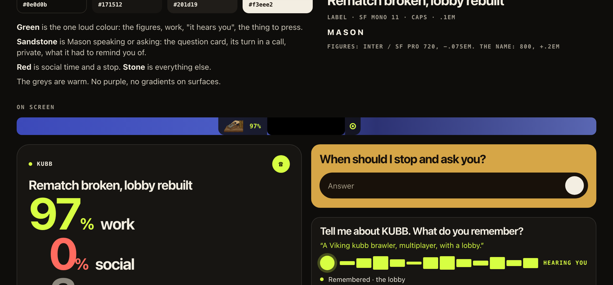

# MASON

You install it and work. Nothing to fill in, nothing to configure, no rules to write.

Mason sits behind real work on this Mac and learns it from what you already do: which project you are in, and what you tell your coding agents. From that alone it can tell you where you left a project a week ago, what you keep having to repeat, and where the day went. When it wants to understand more it does not interrupt: it offers a two-minute voice call you take when you have time.

## Start

Double-click **Mason.app** in this folder (drag it to the Dock to keep it there). It starts its own local server and stops it when it quits. `npm run build:reader` builds the app if it is not there yet. The first run may ask for permission under **System Settings → Privacy & Security → Accessibility** (to read the active app, window title and focused prompt field) and for the microphone (for spoken answers and the call). It takes no screenshots and logs no keystrokes.

If the island says `access` although the switch in System Settings is already on: macOS ties that switch to the exact build it was given to, so after the app has been rebuilt it still reads "on" but no longer counts. Press the island and **Fix access**. Mason forgets the old grant, asks again for this build and opens the list; switch it on there.

**Settings** are under the gear in the app window: what Mason calls you (it starts with the first name on this Mac's account), sound on or off, whether summaries are written through your Claude login, and the state of what it depends on: screen access, ElevenLabs, Claude, and where the memory is.

Quit from the island (right-click → Quit Mason), with ⌘Q in the app window, or with **Stop Mason.command**.

## Three stages on the desktop

Mason is a native macOS app. Nothing opens in a browser.

Every surface is made to be read in one to three seconds: a figure or a few words in large type, icons instead of labels, the detail one press away.

1. **Island.** A strip of dark glass inside the menu bar, growing leftwards from the notch: a hand at work on its mouse, and the work share. It measures where the menus of the app in front end and takes only the free part between them and the notch, so it covers no menu, no status icon and no window. With little room it drops the small bar, then keeps only the mark, and behind a browser with ten menus it is not there at all. When something changes, one word shows for a few seconds: `HACKNATION`, `Private`, `Debrief ready`.
   To the right of the notch sits **the eye**, always: a ring with a pupil while it watches, blinking now and then; one ripple each time it takes in something new on screen (another window, a prompt); a turning arc while it is working something out (a project summary, an episode); a closed line while it looks away; a broken orange ring when it has no access. Nothing moves between those moments.
2. **Numbers.** Press the island. The project you were last in, where you left it in six words, and today's split in large type: work, social, other. Two round buttons: hear where you left off, and the debrief call (lime when one is ready).
3. **App.** Press a number. Three stages, each opening with its own figures:
   - **Capture**: `52% work / 48% social / 0% other`, then one line per project: name, where it was left, time, a play button. Press a line for the rest.
   - **Recap**: this week's episode. One title, three headlines, Play.

## The look



One loud colour, the green, for the figures and for the thing to press. Sandstone is Mason speaking or asking. The greys are warm stone. Every screen is one figure or a few words in large type. The whole guide is a page in the app: `public/brand.html`.

**Liquid glass, to try.** A second look, off until switched on in Settings: the bar floats as a capsule, panels and pills are glass with a bright upper rim, and the pane is darkened so that the text holds over a white desktop (paper and green at 11:1 or more, the greys at 4.9:1 or more). It is plain CSS in `public/glass.css`; there is no refraction, which Safari's engine cannot do. In a browser, `?look=glass` shows it over a painted desktop and `&wall=day` over a bright one.

## What it understands

**Projects.** A project is a folder your tools work in. Mason reads the traces they already leave on this Mac: Claude Code keeps a log per project folder with every prompt and its time, Cursor keeps the folder of every workspace. From that it knows which project the Claude window is about (the one last spoken to), counts a browser tab named after a project as that project, and treats time inside a project as work whatever the window is called. A game you are building is not leisure.

**How you built it.** You build by talking to agents, in a hundred sessions, and a month later the answer is somewhere in session 73. Mason folds every Claude Code session of a project folder into one memory: what it is, how it is put together (the parts, named after the files the agents changed and what the agents reported back), what was built, where you stopped, what was still open. It goes back three weeks. The history is there from the first day you worked on the project, not from the day Mason was installed. Come back to a project after hours or days and the island says so in one line; press and it is read to you in half a minute.

**What you keep saying.** A correction you gave an agent on two or more occasions is a rule you have not written down ("de ska kännas simple as fuck", three times). Mason finds these itself and puts them in the Work Map as inferred guardrails, each with your own words as evidence. A rule only counts when its quote really is something you said. Nobody is asked to set a boundary.

The summaries are written by the Claude login already on this Mac, through the Claude Code CLI in its leanest form (no tools, no plugins, no thinking): a few seconds and a fraction of a cent per project, at most once every ten minutes. Without it the memory is your own last prompts, verbatim.

**As files you own.** The memory is also written to `wiki/` as plain Markdown with links between the notes: `Home`, one note per project, `Rules`, and the Work Map. Open the folder in Obsidian, or in any editor. Settings has a button that shows it in Finder.

**Everything else** is counted by app and window title: work, social, other, always summing to 100. Idle time over 60 seconds is excluded. Password managers, mail, chat, banking, health and private-browsing windows are refused before an event is written. **Go private** pauses all capture at once. The day turns over at 04:00.

## Voice, and where it sits

Voice is not a notification with a microphone. It is the conversation at the end of a block of work.

**The debrief call.** When you come back from a few minutes away after real project work, or when a capture session ends, the island shows one quiet line: the debrief is ready. Nothing rings and nothing opens. Press when you have two minutes. An ElevenLabs agent then calls you inside the panel:

- It opens with what it saw and a real question: *"I watched you move between BITMAGIC HACKATHON and HACKNATION today. What were you trying to get done?"*
- It asks three or four short questions about moves between projects, detours, and things you told your agents, with one follow-up when an answer hides a rule.
- Every answer that holds a decision, a rejected direction or a guardrail is written into the Work Map in your words while you talk; the panel shows each one as it lands.
- It explains the whole thing back and asks *"What did I get wrong?"* When nothing is, the teach-back is confirmed and it hangs up.
- It talks like a colleague who was there: no greeting, no praise, no farewell, nothing a yes or a no answers, one thing at a time.

You always see whether you are heard. The microphone's own level moves around its icon the whole call, and one word says who has the floor: `Mason`, `Your turn`, `Hearing you`. What it understood appears in your words under the caption. A microphone that is open but delivers nothing says `No sound` with the name of the input after two and a half seconds; a blocked one says so with a button to the right setting. The spoken-answer field does the same: `Listening`, `Hearing you`, then your words.

Captions, a live waveform and the saved steps are on screen during the call. Without ElevenLabs the same debrief runs in writing in the app window.

**The tutor call.** Teach → Tutor call. A second ElevenLabs agent, holding only the rules in the Work Map, puts a case to a new hire and lets them decide aloud. A decision that breaks a rule is stopped before it is made: *"Gustaf would stop here. Why do you think?"*, then the reason as a word-for-word quote. Right on the second try counts as mastered, and the call ends by saying what sits and what to practise next. Every stop and recovery is recorded as it happens.

**The week as a podcast.** Recap → Make episode. Two voices, a studio anchor and a field reporter, read your week as a two-minute news bulletin: three headlines, a story per project, the line you repeated most, the numbers, and what is still open on Monday. The figures are counted from the project logs and the quote is one you really said; only the telling is written by the model, and it is told to invent nothing. Text to Dialogue records both voices in one take. It plays from the app itself, so it keeps going with the window closed, and the line being read is on screen. An episode is recorded once and replayed from disk.

**The recall call.** The roles turned around: Mason asks *you* how your own project is put together. In the panel, the round **?** next to the project; in the app window, **Quiz me** in a project's detail. It opens with *"Tell me about KUBB. What do you remember?"* and lets you tell it. Then it says what you had right and brings up what you left out, one thing at a time: *"You also moved matchmaking. What did you decide there?"* If you do not know, it tells you straight, in your own words when it has them. It keeps what you still knew and what it had to remind you of, and it waits twenty seconds for an answer, because remembering takes longer than talking.

**Live questions** happen only inside a capture session you started (the five-to-ten-minute task of the challenge): three to five spoken questions, each after a real pause, at least one about a boundary. A question drops a small panel under the island that never takes the keyboard, opens the microphone by itself, and leaves on a timer. In the background nothing is ever asked.

**Dictation** is in every answer field of the app window: press the microphone, talk, and the words appear as they are heard.

## ElevenLabs

Put the key in `.env.local` (see `.env.local.example`). The file is local and ignored by git.

```dotenv
ELEVENLABS_API_KEY=...
```

| Where | Product | Cost control |
|---|---|---|
| The debrief call, both ways | Agents (conversational) | Created once and reused. A call is capped at four minutes. The model behind it is `gemini-2.0-flash`; `ELEVENLABS_AGENT_LLM` picks another. |
| The tutor call | Agents (conversational) | A second agent, created once. It is given the rules only, never the day's activity. |
| The recall call | Agents (conversational) | A third agent, created once. It is given what is remembered about one project. |
| The weekly episode | Text to Dialogue, v3, two voices | One take of about two minutes per episode, kept on disk. If it is refused, the same lines are read one by one with Flash. |
| Spoken questions, where you left off, today's recap | Text to Speech, Flash v2.5 | Half the credits of the multilingual model. Every sentence is cached on disk and replayed for free. |
| Spoken answers and dictation | Scribe v2 Realtime | Push-to-talk only. The socket exists from the press to the end of the sentence, at most 45 seconds. |

`ELEVENLABS_VOICE_ID` picks another voice, `ELEVENLABS_LANGUAGE` (for example `sv`) changes the language of the agent and of dictation. The key never reaches a page: the server hands out a single-use Scribe token and a signed call link.

## The model

A model is used for five things: the summary of a project, the script of the weekly recap, saying which of your repeated rules mean the same, saying which of the things you said again and again is a way of working and not a job, and saying what each project was for (building, design, writing, research, going to market). Everything else is plain code. By default the model is Claude through your own login (the Claude Code CLI), the same place your prompts already went: it is sent redacted excerpts of them. To use another, name it in `.env.local`:

```dotenv
APPRENTICE_LLM_URL=http://127.0.0.1:11434/v1   # Ollama on this Mac; or any provider's OpenAI-style address
APPRENTICE_LLM_MODEL=llama3.2
APPRENTICE_LLM_KEY=                             # only when the provider asks for one
```

Anything that answers in the OpenAI chat format works. With a model on the Mac and ElevenLabs switched off, nothing leaves it. **Summaries** in Settings shows which model is writing and switches it off (`APPRENTICE_LLM=0` does the same); the memory is then your own words.

What the model takes is counted and shown on the same row: the tokens of today, and under it the last seven days and what most of them went to. The count is the provider's own figure for each answered call; nothing of what was sent or answered is kept with it. A summary sends some six thousand tokens of your prompts, so it is written an hour after you leave a project and not while you work in it. When the model refuses (a login that ran out, a key that is not taken, no usage left) the row says so, and how to mend it.

## Finding what you said, by what it means

Off until you switch it on, in Settings or on **More → Find**. An embedding model on this Mac reads what you said to your agents and places each prompt by its meaning. **Find** then answers in projects: "where did I cut film" finds the project, with the words it rests on. With nothing typed, it shows what you said again and again across projects, in your own words and with the count. The model writes nothing and nothing is sent anywhere: it runs under llama.cpp while it is needed, listens on this Mac only, and is stopped after three minutes of quiet.

What you said again and again can become a proposal on Today, the same card with the same yes and no as before. Which prompts mean the same is worked out by the embedding model alone. The model that writes summaries is then asked one thing: which of these is a way of working ("start the local server so I can look") and which is a job asked for now and then ("go through the page for search engines"), and it words the first kind as a rule. Anything about publishing, pushing, uploading or deleting is held back before it is asked. With Summaries switched off nothing is proposed from here, and the list on Find stays as it is.

Two files are needed, and neither is in the repository:

- A model, a `.gguf` file, in `data/models/`. It was built with [EmbeddingGemma 2](https://huggingface.co/ggml-org/embeddinggemma-2-GGUF) (`embeddinggemma-2-Q8_0.gguf`, 310 MB, Apache 2.0). Mason never downloads it by itself.
- llama.cpp. `brew install llama.cpp` is enough once Homebrew ships a version that knows the model; until then, a build from [its releases](https://github.com/ggml-org/llama.cpp/releases) unpacked into `.runtime/llama/` is used first.

Any other model works the same way, and the index starts again when it changes:

```dotenv
APPRENTICE_EMBED_URL=http://127.0.0.1:11434/v1   # anything that answers in the OpenAI embeddings format
APPRENTICE_EMBED_MODEL=nomic-embed-text           # or the path of a .gguf file for llama.cpp
```

Each prompt is kept redacted, up to 600 characters, with its row of numbers in `data/said/`. **Forget** in Settings empties it. What was said after the first 600 characters of a prompt cannot be found.

## Nudges

A nudge is a word on the island at the moment it can be acted on. It comes from what is happening and rests on your own history, never on a clock or a list you keep. There are two:

- **Waited 9 min · PROJECT.** An answer that has waited twice as long as you usually leave one, while you are at the Mac in another tool. What is usual is the middle one of your own waits over the last week.
- **Done before · PROJECT.** A prompt you just sent is the same piece of work as one in another project, a day or more ago. The line in the drop panel opens Find on it. Needs **What you said, by meaning** switched on.

Each nudge is followed up. Back where answers are read within a minute and a half, or the earlier project looked up or named in your next prompt, counts as followed; otherwise it counts as ignored. A kind that is ignored three times in a row goes quiet for two weeks by itself. At most one nudge in ten minutes and six in a day. **A word on the island** in Settings shows how the last week of them went and switches them all off.

A third was tried and left out: "the third try at the same thing". Against four months of real prompts the embedding model could not tell "it does not work" from "now it works", so it would have been wrong.

## A replay to share

**Flow → Replay.** A piece of real work for someone else to sit beside: every prompt as it was said, how long the agent worked on it, where you were meanwhile, and how long the answer waited. Nothing is recorded for it. It is cut afterwards from what Mason keeps anyway, so there is no button to remember before the work starts.

What is cut is a piece of work, not a length of time: the prompts said in one project with no half hour of silence between them. Mason offers today's pieces and opens on the latest. You read every line and press the ones to leave out. Until you switch names on, a project is "Project A", a site without a name of its own is "a website", and your home folder is "~". **Save page** writes one HTML file that stands by itself to `data/share/`; **Copy as text** puts the same thing on the clipboard for a chat. Mason posts nothing.

The page carries its figures a second time as data, without any of its words (prompts, jumps, tools, the middle length of a prompt and of a wait), so that replays from several people can be put side by side without anyone reading anyone's prompts.

A replay shows your half only. What the agent answered is not in it yet.

## Your workflow, and other people's

**Workflow.** Thirty days of the agents' logs as one card: which agent you talk to and how much, prompts an hour, how a piece of work runs (how many prompts, how long, how long the first one is), how long an agent works on one prompt, how many projects a day, the tokens a day of work takes, and what you tell your agents again and again. Where Mason has watched the screen it adds how long a finished answer waits and the tools around the agents, by what each is for. It is read from logs that are already on the Mac, so it is there the first day. With a model, each project is placed by what it was for and there is a card for each; without one there is the one card.

**Share** makes it a picture and a file (`data/share/mason-workflow-*.json`). The file holds figures, the names of tools Mason knows, and the rules you left in, each read before it goes. No project, no file name, nothing you said. Mason posts nothing.

**Open one.** Choose someone else's file, or drop it on the view. Theirs is shown in the large figures with yours beside each, for the same kind of work. A rule of theirs is not written by Mason. It is handed to an agent you choose: beside the rule stand the agents on this Mac that open with a prompt in their input (Claude Code, Codex, Cursor), and **Copy prompt** for any other. The agent opens with the prompt ready and not sent; you read it and press Enter, and the agent shows the change before it saves. The prompt asks for one line under `## Learned by Mason` in each rules file that exists (`~/.claude/CLAUDE.md`, `~/.codex/AGENTS.md`, `~/.grok/AGENTS.md`), so one hand-over reaches every agent. Mason reads those files to say whose rules already hold a rule.

That file is a stranger's, and its rules go where an agent reads its instructions, so nothing in it is taken as it stands. Figures are read as figures, names are cut short, and only tools Mason knows are named. A rule is offered only when it is one plain sentence about how to work: no command, no address, no path, nothing about secrets, nothing that tells an agent to set its rules aside or to stop asking, nothing about publishing, sending, deleting or paying, no character that cannot be seen, and nothing laid out as a heading, a list or a link. A rule that is held back is still shown, with the reason, and is not handed over. In the prompt the rule stands fenced off as words to store, which a rule that is offered cannot break out of. This is a net, not a judge: read the prompt before you send it.

**The collection** is the folder [`workflows/`](../workflows/) of this repository, one file for each workflow and a page made from them. **Add to the collection** in the share dialog copies yours in the form the collection keeps and opens a form in the browser to paste it into; it is sent from there, by you, or not at all. A file is let in only in the one form a careful reading gives it, which `npm run workflows -- check` checks, here and on every pull request.

## Logos from the web

Off until you switch it on in Settings. A tool that is a site has no app to lend it an icon, so it shows a lettered tile. Switched on, Mason asks each site you used for its own icon, once, over https, and keeps the picture in `data/icons/`. It asks only public names: never an address on this Mac or on the network at home, and it follows a site's redirects one step at a time for the same reason. Only pictures are kept, never an SVG.

## What it writes outside its own folder

One file, and only when you press: a proposal you say yes to becomes one line under the heading `## Learned by Mason` in `~/.claude/CLAUDE.md`, the file every Claude Code agent on the Mac reads. The line is shown before it is written and its words can be changed. The file as it was before Mason first touched it is kept as `data/rules-before-mason.md`, and **Told every agent** in Settings takes a line out again. `APPRENTICE_RULES_FILE` points it at another file.

## What it reads

| | How | Kept |
|---|---|---|
| The screen | macOS Accessibility, which you grant once: the front app, the window title, the site of a browser's front tab and the text of a prompt field. | Events, with redacted excerpts. Of an address only the host ("figma.com"), never the path or the query. Never pictures or keystrokes. |
| Agent logs | Claude Code writes every session to `~/.claude/projects`. They are your own files and need no permission; Mason reads what you said, the names of the files the agents changed, what they reported, and the count of tokens each answer took. Of Cursor it reads only which folder each workspace is, and when it was last used. | Redacted excerpts, file names, minutes per day. **Agent logs** in Settings switches it off. |
| Chat and mail | Not read. Counted as a refusal. With **Chat and mail by name** switched on, the name of the app or site and the time spent there are kept, so Flow shows every jump. Password managers, banking, health and private windows are never named. | Name and time only, never a title. |

ElevenLabs has a switch in Settings, next to what is left of the month's credits. Switched off, Mason speaks with the Mac's own voice, answers are typed, there are no calls, and nothing is sent or spent.

What leaves the Mac for ElevenLabs, and only when a key is set and the switch is on: the text to be spoken, the audio of an answer while the microphone is open, and for a call the day's summary (project names, minutes, the sites outside the projects without their titles, and redacted excerpts of your prompts).

**Codex and Grok too.** The sessions Codex keeps in `~/.codex/sessions` and Grok in `~/.grok/sessions` are read into the same projects, under the same **Agent logs** switch. A session you typed in is yours: its prompts count as said and its answers as waiting for you. A session another agent started with a brief of its own counts as time worked on the project, and as tokens taken, and nothing more.

## Who the server answers

The server listens on `127.0.0.1` and nowhere else. A page in a browser is on this Mac too, though, and a browser lets any page send a request to an address on the same machine. So a request is answered only when it was addressed to this Mac by number or as `localhost`, and, when a browser says which page sent it, only when that page is Mason's own. The island, the agents and a terminal name no page and are let through. A link someone sends cannot switch a setting, read the memory or have a rule written.

It does trust this Mac. A program that runs here and is not a browser, or an agent that may call a local address, can ask the server what Mason's own window can: read the memory, switch a setting, say yes to an open proposal. So the words of a proposal are checked like a stranger's before they are written, whoever asks, and nothing a caller sends is spoken or run. A secret for each start, known only to Mason's own window, would close this and is not built yet.

## The challenge, module by module

| Module | Where | What proves it |
|---|---|---|
| Capture | 01 Capture → Start a capture session | Three to five spoken questions in a real task, each after a pause and about what is on screen, at least one about a boundary. One at a time; an unanswered one moves to the debrief. |
| Map | The debrief call, then 02 Map | The agent asks what the task left open, explains it back, and the expert confirms aloud. Every step shows its moment, the decision, the expert's words and the guardrail. |
| Teach | 03 Teach → Tutor call | A new person decides aloud in a case the expert never showed. The tutor stops a wrong decision before it is made, explains why in the expert's own words, and records what stopped them and what they got right on the second try. **Check** does the same for one written decision, without a model. |

The five questions of the Mason Test:

1. **When to ask.** Never in the background. In a session: the prompt text has been still for six seconds, or the hands have been still since a move between apps, then ninety seconds of cooldown. The debrief is offered at a break, not started.
2. **What to ask.** The agent is given the projects, the moves, the detours and your own prompts, and is told never to ask what the screen already answers.
3. **When it has understood.** It has explained the process back and you said yes. Corrections are saved and repeated first.
4. **Whether the new hire learned.** Teach records what stopped them and what they got right on the second try.
5. **Trust.** Go private, refused private surfaces counted but never named, redaction before anything is written, events instead of screenshots, a quiet background.

## MCP

```json
{
  "mcpServers": {
    "mason": {
      "command": "node",
      "args": ["/absolute/path/to/apprentice/src/mcp.mjs"]
    }
  }
}
```

Tools: `what_happened_last`, `what_did_you_learn`, `what_are_you_unsure_about`, `how_was_the_day`, `how_was_it_built`, `search_work_map`, `check_decision`, `guardrails_for_agents`. `how_was_it_built` gives any agent the memory of a project: start a new session in a month-old folder and it knows how the thing is put together before you have explained anything. The last two are the agent-ready guardrails: another agent can check a planned action before it acts, or load the whole map as instructions. The same handler answers at `http://127.0.0.1:4317/mcp`.

## Recording the demo

1. Start Mason. Work in your own tools; the island shows the project you are in.
2. **01 Capture → Start a capture session**, close the window, keep working for five to ten minutes and answer the spoken questions aloud.
3. Press the island, **End session**, then **Take the call**. Answer three questions, say yes to the teach-back. Use headphones, or let it finish each sentence before you answer.
4. **02 Map**: open a step saved from the call. **03 Teach**: **Tutor call**, say a decision that breaks a rule, get stopped, correct it.
5. **Recap**: Play the week's episode for a few seconds.
6. Press **Go private** once on camera, then resume.

## Verify

```bash
npm test
```

```bash
npm run build:reader
```

A rehearsal instance with its own memory, no voice and no island, for trying the flows without touching the real Work Map:

```bash
PORT=4318 APPRENTICE_DATA=/tmp/apprentice-rehearsal APPRENTICE_MUTE=1 APPRENTICE_OVERLAY=0 APPRENTICE_COLLECT=0 node src/server.mjs
```

## Boundaries of this slice

- Memory is built from the Claude Code logs on this Mac: your prompts, the names of the files the agents changed, and what the agents reported back. Chats in ChatGPT or on claude.ai are not on disk and are not read; a project worked on only there, or only in Cursor or Codex, has time but no memory yet.
- What a part does is taken from the agents' own reports and can be wrong where they were. File contents are never read.
- Projects come from Claude Code, Codex, Grok and Cursor. Work done only in ChatGPT or a terminal is counted as time but not tied to a project.
- Tokens are each agent's own count, read from its log: what it read for the first time, what it read again from a cache, and what it wrote. Most of a month is the same conversation read again. It is a count and not a cost, and Cursor's are not read.
- What a project was for is the model's reading of one line about it. The card for a purpose is as right as that reading.
- A call is an open line: start talking and the agent stops. If it keeps hearing itself through the laptop speakers it falls back to taking turns, and **Cut in** (or the space bar) still interrupts it. Headphones avoid the fallback.
- Live questions in a session and the written **Check** are deterministic: a new decision is matched to a guardrail by shared terms and a short list of synonyms, so a paraphrase with no word in common is not caught. The tutor call judges by meaning.
- The week's episode covers work that left a Claude Code log. Its hours are the minutes in which those logs were active, not time at the screen.
- The island is glass but small and still: a blurred strip the height of the menu bar, no continuous animation, one small request every 2.5 seconds. Full accessibility is requested once per app, and only where a prompt can be read.

## License

MIT. See `LICENSE` in the repository root.
